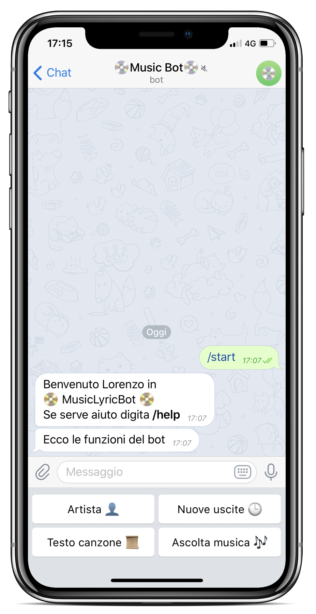

# Music API #

## Progetto Piattaforme Digitali per la Gestione del Territorio ##

[logo]: img/screen_bot_benvenuto.png

### Alunni ###
+ [Lorenzo Genghini](https://github.com/Lorenzo1997)
+ [Alberto Spadoni](https://github.com/Albisyx)

---

### Obbiettivi ###
Il progetto **Music API**, si pone i seguenti obbiettivi:
1. Partendo da un determinato artista, fornisce alcune informazioni e le 10 canzoni più popolari di quest'ultimo
2. Permette di conoscere gli album usciti recentemente
3. Da la possibilità di cercare il testo delle canzoni desiderate
4. Consente di ascoltare della musica

---

### Componenti ###
Music API è composta da 2 parti:
+ La vera e propria API, sviluppata in **NodeJS + Express**
+ Un client realizzato sottoforma di un **Bot per Telegram**, che rende semplice l'interfacciamento fra utente e API

---

## Descrizione ##

#### API ####
L'API mette a disposizione alcuni metodi, di tipo GET, che sfrutttano le API di Spotify e quelle di Lirycs.ovh per effettuare le operazioni sopra citate.

Per raggiungere gli obbiettivi 1, 2 e 4, si prelevano le informazioni necessarie da Spotify. Per fare ciò è necessario autenticarsi utilizzando il metodo Client Credentials messo a disposizione da Spotify stesso. In breve, il metodo, autentica il client fornendogli un token che potrà essere utilizzato per accedere al data base di Spotify, tramite opportune richieste HTTP.

Passi per l'ottenimetno delle informazioni da Spotify:
Si effettua la richiesta HTTP di interesse, inviando un'opportuno header contenente il token di accesso precedentemente ottenuto.
A questo punto, se la richiesta è andata a buon fine, verranno restituite, in formato JSON, le informazioni corrispondenti alla richiesta e ai parametri scelti.
Ora viene composto il JSON, contentente le informazioni più rilevanti, che poi verrà successivamente restituito nel corpo della risposta.

Per quanto riguarda il terzo obbiettivo, ci si è appoggiati all'API di Lirycs.ovh. Quest'ultima non ha bisogno di alcuna autenticazione, quindi basta effettuare una semplice richiesta HTTP rispettando la sintassi.

Passi per l'ottenimento del testo tramite Lirycs.ovh:
Qesta API richiede come parametri sia il nome dell'artista che quello della canzone. Music API permette di utilizzarla in due modi:
+ Fornendo solo il nome della canzone
+ Inserendo sia il nome della canzone che quello dell'artista

Nel primo caso occore ricavare il nome dell'artista per rispettare la sintassi di Lirycs.ovh. Questa informazione viene ricavata chiamando ancora una volta in causa le API di Spotify.

#### Bot ####
<div><a></a> 
Il bot permette un facile interfacciamento con l'API, fornendo all'utente le informazioni direttamente sullo smartphone.

Per un miglior funzionamento del bot, si è utilizzato un database MySQL fornito da Altervista. Questo fa si che l'utilizzo da parte dell'utente, sia più naturale


Esso si presenta con una serie di bottoni corrispondenti a ognuna delle quattro macro funzioni dell'API:
+ **Artista 👤 ->** Digitando il nome di un artista, il bot può restituire:
	* Le dieci canzoni più popolari
	* Alcune informazioni come nome, followers, popolarità, gereri dell'artista e una foto di esso
+ **Nuove uscite 🕒 ->** Connettendosi a Spotify, mostra i cinque album usciti più recentemente. Ogni album è caratterizzato dal nome, data di uscita, compositori, link ad esso su Spotify e l'immagine di copertina.
+ **Testo canzone 📜 ->** Restituisce il testo di una data canzone. La ricerca può avvenire in due modi:
	* Digitando solo il titolo della canzone
	* Inserendo il nome dell'artista più il titolo della canzone, in questo formato:
	  ```
	  nome_artista:titolo_canzone
	  ```
+ **Ascolta musica 🎶 ->** Permette di riprodurre una canzone partendo dal titolo. Le tracce possono essere ascoltate con una preview di 30 secondi oppore completamente per chi possiede un account su Spotify.
</div>